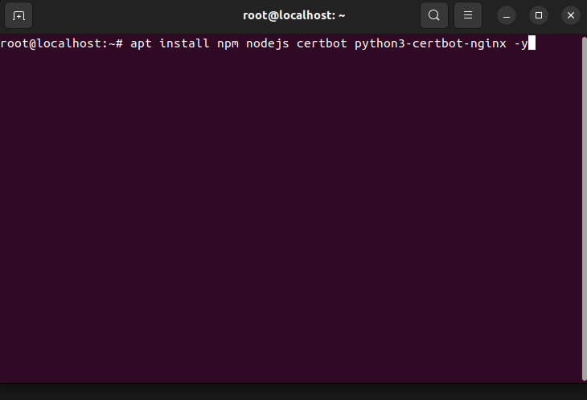
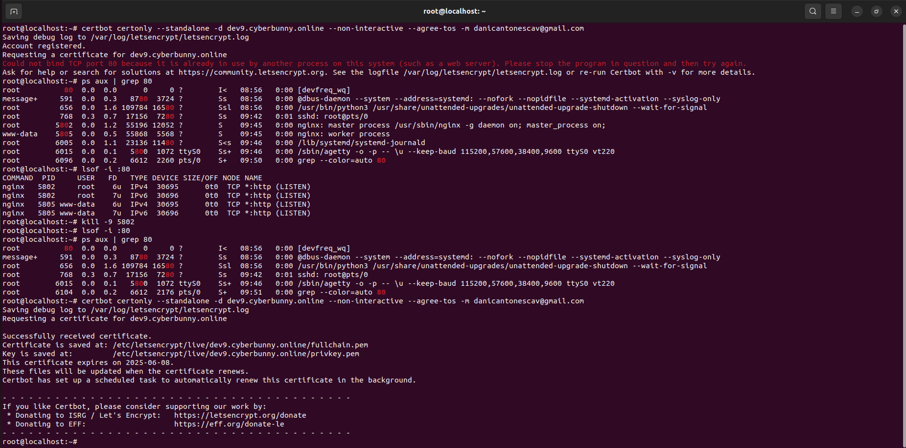
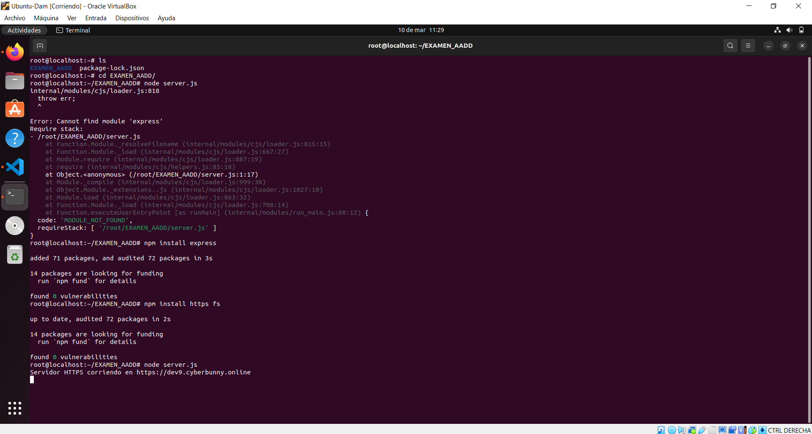
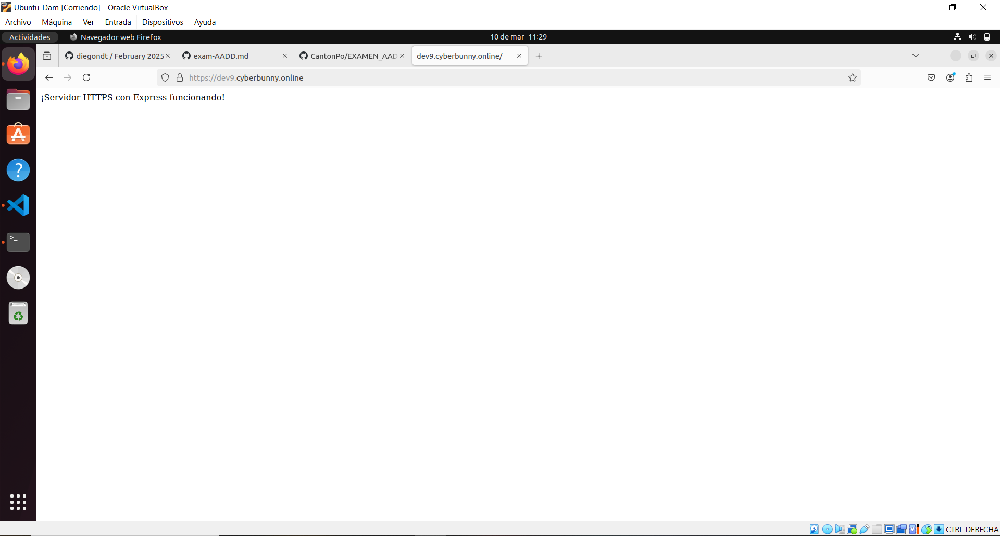
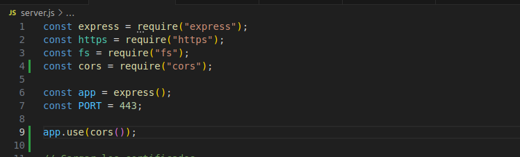
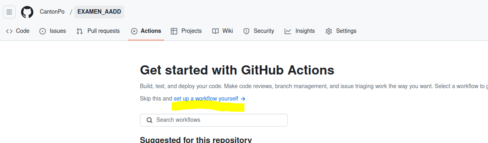
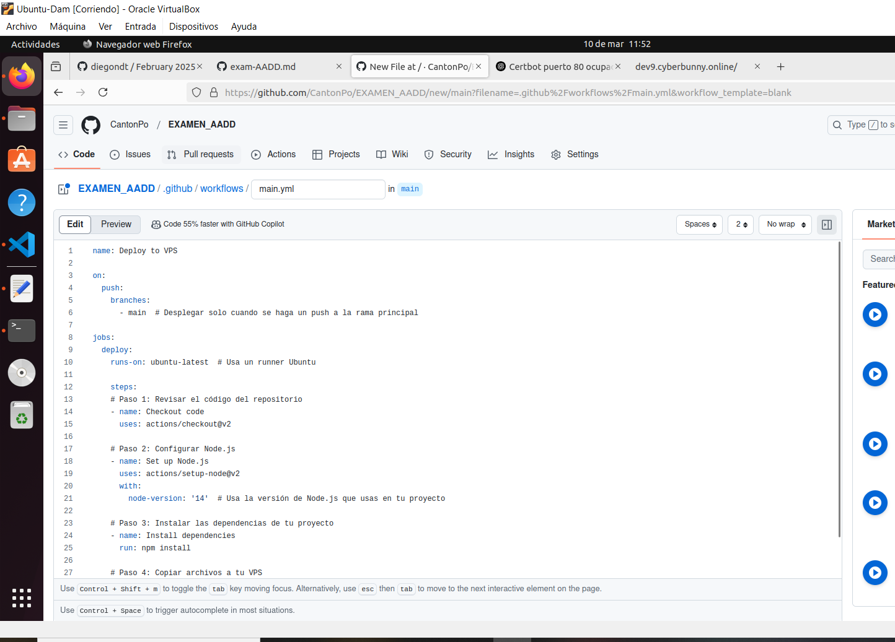

# EXAMEN_AADD
## DANIEL CANTÓN CORPAS

Aquí ire redactando los pasos del examen

## 1º PASO

  - Accederemos por SSH (desde la terminal) a un VPS preparado por el profesor, el nos a asignado una ip y una contraseña para que podamos acceder.
  - Una vez que estemos dentro instalaremos dependencias y todo lo que nos haga falta.
  - 

  -Solicitamos certificados. 
  - 
  
  -Clonamos el repositorio de GitHub e instalamos express.
  - 
  - 

## 2º PASO
  - Creamos nuestro server.js implementando express, cors y https.
  - 

## 3º PASO
  - Ahora vamos a realizar el workflow con github para que nos realize esto automatizado.
  - 
  -  
